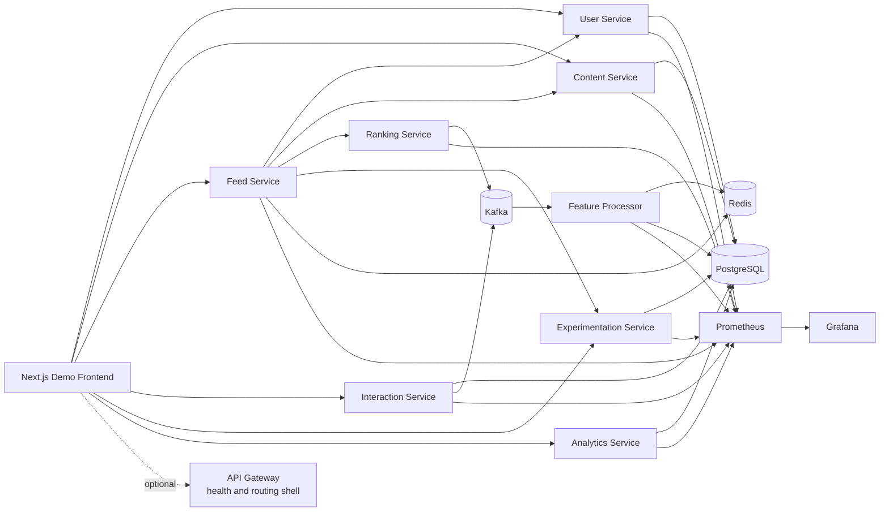

# Real-Time Content Ranking System

An event-driven platform that ingests user interactions, materializes ranking features in near real time, and serves an explainable personalized feed with experimentation and operational telemetry built in.

This repository is structured like a serious backend portfolio project rather than a single demo app. It includes domain services, Kafka-based event flow, Redis feature materialization, deterministic ranking, experiment analytics, a polished frontend, and local observability assets.

## Project Overview

The system models a LinkedIn-style learning feed for technical content across AI, backend engineering, system design, DevOps, and interview preparation.

What it demonstrates:

- event-driven ingestion with Kafka and durable audit storage
- low-latency ranking features in Redis backed by PostgreSQL snapshots
- deterministic, explainable scoring with multiple ranking strategies
- experiment assignment, exposure logging, and attributed outcome analytics
- a demo frontend that makes the distributed system visible instead of hiding it
- Prometheus, Grafana, structured logging, correlation IDs, and readiness/liveness checks

## Architecture Diagram



Notes:

- The frontend currently talks directly to service endpoints for the demo flow.
- `api-gateway` exists in the repo, but it is not the primary path for the current web app.
- Docker Compose provisions infrastructure and monitoring. The repository now includes a one-command stack runner that starts infra, services, seeds, and the frontend together.

## Service Breakdown

| Service | Responsibility | Key API / Output | Primary Storage |
| --- | --- | --- | --- |
| `user-service` | User accounts and topic preferences | `/api/v1/users` | PostgreSQL |
| `content-service` | Content metadata, tags, draft/published state | `/api/v1/content` | PostgreSQL |
| `interaction-service` | Validates and persists interaction events, then publishes Kafka records | `/api/v1/interactions` | PostgreSQL, Kafka |
| `feature-processor` | Consumes interaction events and computes low-latency feature vectors | `interactions.events.v1` consumer | Redis, PostgreSQL |
| `ranking-service` | Scores candidates with deterministic rules-based strategies | `/api/v1/rankings`, `ranking.decisions.v1` | Kafka |
| `feed-service` | Retrieves candidates, calls ranking, records exposures, caches pages | `/api/v1/feed` | Redis |
| `experimentation-service` | Deterministic assignment and feed exposure persistence | `/api/v1/experiments/*` | PostgreSQL |
| `analytics-service` | Attributed experiment comparison metrics | `/api/v1/experiments/{key}/comparison` | PostgreSQL |
| `api-gateway` | Reserved entry shell for routing and platform concerns | health endpoints | none |
| `apps/web` | Demo UI for feed, insights, and experiment analytics | `/`, `/feed`, `/insights`, `/experiments` | browser state |

Shared packages:

- `packages/shared-schemas`: versioned DTOs, event schemas, enums, and validation helpers
- `packages/shared-config`: shared environment/config access
- `packages/shared-clients`: HTTP and Kafka client abstractions
- `packages/shared-logging`: structured logging, metrics, readiness helpers, HTTP observability

## Local Setup

### One-command demo stack

After the Python virtualenv and frontend dependencies are installed once, you can boot the full local system with:

```bash
bash scripts/run_demo_stack.sh
```

This single command will:

- start Docker infrastructure and monitoring
- wait for PostgreSQL, Redis, and Kafka
- run all Alembic migrations
- reseed the deterministic demo dataset
- start every backend service
- build and start the frontend on `http://localhost:3001`

Useful follow-up commands:

```bash
bash scripts/run_demo_stack.sh status
bash scripts/run_demo_stack.sh down
```

### Prerequisites

- Python 3.11
- Node.js 18+
- Docker with `docker compose`

If your default `python` points to 3.13 or an Anaconda base environment, use `python3.11`
explicitly for the virtual environment and migration commands.

### 1. Start infrastructure

```bash
cp .env.example .env
cp apps/web/.env.example apps/web/.env.local
docker compose -f infra/docker/docker-compose.yml up -d
```

This starts PostgreSQL, Redis, Kafka, Zookeeper, Prometheus, and Grafana.

### 2. Create a Python environment and install dependencies

```bash
python3.11 -m venv .venv
source .venv/bin/activate
pip install -U pip
pip install -r scripts/requirements.txt
for service in services/*; do
  if [ -f "$service/requirements.txt" ]; then
    pip install -r "$service/requirements.txt"
  fi
done
```

Install the frontend dependencies once:

```bash
npm --prefix apps/web install
```

If you already created `.venv` before the latest fixes, repair it with:

```bash
pip install greenlet==3.0.3
for service in services/*; do
  if [ -f "$service/requirements.txt" ]; then
    pip install -r "$service/requirements.txt"
  fi
done
```

### 3. Run database migrations

```bash
bash scripts/run_migrations.sh
```

If migrations fail with `DuplicateTable` because local tables already exist from an earlier run, reset the local PostgreSQL schema and rerun migrations:

```bash
python scripts/reset_local_database.py
bash scripts/run_migrations.sh
```

### 4. Load deterministic demo data

```bash
bash scripts/setup_demo.sh
```

Optional for a fully frozen demo:

```bash
export DEMO_REFERENCE_TIME=2026-04-08T14:00:00+00:00
export RANKING_FIXED_NOW=2026-04-08T14:00:00+00:00
bash scripts/setup_demo.sh
```

### 5. Start backend services from source

Open one terminal per service:

```bash
bash scripts/run_service.sh user-service
bash scripts/run_service.sh content-service
bash scripts/run_service.sh interaction-service
bash scripts/run_service.sh ranking-service
bash scripts/run_service.sh feed-service
bash scripts/run_service.sh experimentation-service
bash scripts/run_service.sh analytics-service
```

Optional live streaming processor:

```bash
bash scripts/run_service.sh feature-processor
```

### 6. Start the frontend

```bash
cd apps/web
npm install
npm run dev -- --port 3001
```

### Local URLs

- Frontend: `http://localhost:3001`
- User service: `http://localhost:8001/api/v1/health`
- Content service: `http://localhost:8002/api/v1/health`
- Interaction service: `http://localhost:8003/api/v1/health`
- Feed service: `http://localhost:8004/api/v1/health`
- Ranking service: `http://localhost:8005/api/v1/health`
- Experimentation service: `http://localhost:8006/api/v1/health`
- Analytics service: `http://localhost:8007/api/v1/health`
- Feature processor: `http://localhost:8008/api/v1/health`
- Prometheus: `http://localhost:9090`
- Grafana: `http://localhost:3000` with `admin / admin`

## Demo Flow

The cleanest walkthrough for a recruiter, hiring manager, or interviewer:

1. Open `/` and explain the platform at a high level.
2. Move to `/feed` and pick `alice_dev` for the baseline personalized feed story.
3. Open the score breakdown drawer for a top item and explain affinity, recency, engagement, trending, and diversity penalty contributions.
4. Trigger `like`, `save`, `skip`, and `click` actions to show real event ingestion.
5. Move to `/insights` to connect the user profile, trending content, and session event stream.
6. Move to `/experiments` to show deterministic assignment and attributed strategy metrics.
7. Open Grafana to show request throughput, ranking latency, and event pipeline health.

For a deterministic set of user stories, use the scenarios in [docs/demo-scenarios.md](docs/demo-scenarios.md).

## Screenshots

The repository includes a capture plan for portfolio screenshots in [docs/screenshots/README.md](docs/screenshots/README.md).

Suggested final screenshots:

- feed page with score breakdown drawer open
- insights page with topic profile and trending charts
- experiment dashboard with strategy comparison bars
- Grafana dashboard showing feed and event pipeline metrics

## Repository Layout

```text
apps/
  web/                      Frontend demo application
services/
  api-gateway/              Reserved gateway shell
  user-service/             User and profile domain service
  content-service/          Content metadata service
  interaction-service/      Event ingestion entry point
  feed-service/             Candidate retrieval and feed assembly
  ranking-service/          Deterministic scoring and decision events
  experimentation-service/  Assignment and exposure persistence
  analytics-service/        Experiment outcome aggregation
  feature-processor/        Kafka consumer and feature materializer
packages/
  shared-schemas/           Versioned DTOs and event schemas
  shared-config/            Shared configuration helpers
  shared-clients/           HTTP and Kafka clients
  shared-logging/           Logging, metrics, and health helpers
infra/
  docker/                   Compose, Prometheus, Grafana, DB init
docs/
  architecture, API, runbooks, demo notes, interview notes
scripts/
  demo reset/bootstrap helpers, formatting, linting, service runner
```

## Why This Project Matters

This repo is intentionally opinionated:

- it isolates ranking logic so it can be replaced later by ML models
- it keeps schemas explicit and versioned instead of passing ad hoc JSON
- it treats observability as part of the product, not an afterthought
- it makes experiment attribution and explainability visible in the UI
- it is realistic enough to discuss tradeoffs, scaling paths, and operational concerns in an interview

## Additional Documentation

- [Architecture overview](docs/architecture-overview.md)
- [API reference index](docs/api/README.md)
- [Observability guide](docs/observability.md)
- [Demo scenarios](docs/demo-scenarios.md)
- [Interview guide](docs/interview-guide.md)
- [Tradeoffs and lessons learned](docs/project-retrospective.md)
- [Local monitoring runbook](docs/runbooks/local-monitoring.md)
- [Debugging runbook](docs/runbooks/debugging.md)

## License

MIT. See [LICENSE](LICENSE).
